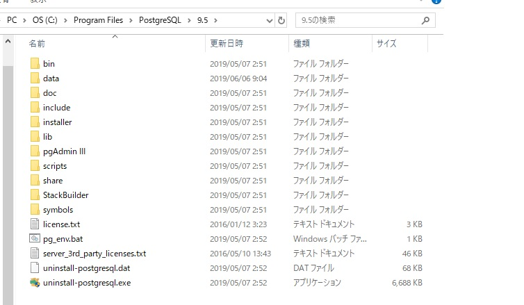

# PostgreSQLメモ
# 目次
- [構成](#構成)
- [設定](#設定)
- [データ型](#データ型一覧)
- [Postgresコマンド](#Postgresコマンド)
- [その他コマンド類](#その他コマンド類)
- [SQLコマンド](#SQLコマンド)
- [用語集](#用語集)

# 概要
2019.6月時点ではPostgreSQL9.0が最新。
# 構成
PostgreSQLのファイル構成は図１の通り。普段触るのは大体dataフォルダ。  

||
|:---:|
|図１ PostgreSQL構成|
#### dataフォルダ
postgresが管理するデータを実際に記録する領域(=データベースクラスタ)。
このデータベースクラスタが無いと、PostgreSQLサーバーは起動できない。※１  
具体的な中身として主なものは、以下の通り。
なお、各設定ファイル詳細は後述の「設定」に記載する。
1. グローバルデータ
   - ユーザー情報など
2. システムが使用する領域
   - あ
3. 設定ファイル
   - postgresql.conf
     - 接続・認証/ハードリソース/ログ/レプリケーション/オプティマイザー等の設定ファイル
   - pg_hba.conf
     - ホストベース認証(接続元ホストのIP、接続先DB名、ユーザーなどの組み合わせ)の設定ファイル。
     - postgresql.confがDBが入っているマシンの設定に対し、これは接続相手に関する設定

4. DB
   - template0 : 文字通り、テンプレートとなるDB。これを元にユーザー作成のDBが作られる。変更不可。
   - template1 : 〃。変更可の為、ここに共通で引き継がせたい自作テンプレートを作れる。

>※１：initdbコマンドでDBクラスタが作れる。  
>　　　普段はインストーラが最初にやってくれている？？

#### lib  
- DLLファイル
#### scripts 
- windowsのスタートメニューからpsqlの起動やサーバの起動・停止を行うスクリプト
#### share 
- PostgreSQLに必要な様々な共有ファイル
 

# 設定
#### postgresql.confの設定
コード抜粋してコメントで解説記載。
```postgres
#------------------------------------------------------------------------------
# CONNECTIONS AND AUTHENTICATION
#------------------------------------------------------------------------------
# - Connection Settings -
# TCP許可する場合、「liseten_addresses='*'」とする。
listen_addresses = '*'		# what IP address(es) to listen on;
					# comma-separated list of addresses;
					# defaults to 'localhost'; use '*' for all
					# (change requires restart)
# ポート設定
port = 5432				# (change requires restart)
# 最大接続数の設定
max_connections = 100			# (change requires restart)

```
# データ型一覧
| データ種別 | データ型         | 概要 | 
| :---:     | :---:             | ---  |
| 数値型     |integer           | 4バイト　-2,147,483,648～2147483647整数|
|           |smallint           | 2バイト　-32768～32647整数
|           | bigint            | 8バイト　-9223372036854775808～9223372036854775807整数
|           | real	           |4バイト　浮動小数(6桁精度)
|           | double precision | 8バイト　浮動小数(15桁制度)|
|           | serial            | 4バイト　1～2147483647に自動連番|
|文字型      | varchar[(n)]     | 可変長　最大n文字の長さ。文字分だけ格納。上限越えはエラー。
|           |char[(n)]          |固定長　指定文字列以下の場合、上限まで空白で埋められる。
|           |text               | 可変長　長さ無制限。
|日付/時刻　| date              |4バイト　日付
|          |time[(p)]          | 8バイト　時刻。※引数(p)は、秒の小数点以下の制度(0～6で指定)
|           |interval[(p)]      |12バイト　時間間隔
|           | timestamp[(p)]    |8バイト　日付と時刻療法
|ネットワークアドレス型|cidr |12or24バイト　IPv4 or IPv6ネットワーク
|           |inet           | 12or24バイト　IPv4 or IPv6ホスト、ネットワーク
|           |macaddr        |6バイト　MACアドレス

# SQLコマンド
### スキーマ削除(リストア前)
```postgres
//publicスキーマごと削除
$ DROP SCHEMA public cascade;
//publicスキーマを生成する
$ CREATE SCHEMA public;
```

### 実行計画表示 / 実測値
- EXPLAIN文  
  - クエリを分解して、プランナ/オプティマイザが生成する実行計画(問い合わせ計画)を表示するコマンド。  
  - プランナ/オプティマイザで最適な実行計画を決める為に使用されるコストの見積もりや、実際に実行される時間などを測定できる。
  - EXPLAIN文を使用することで、postgresqlの実行計画が最適なのかを確認することができる  
    (クエリチューニングに活かせる)
- EXPLAIN ANALYZE文  
  - 実際にクエリを実行し、実際の情報を表示する。
  - 時間はmsであり、"コスト"とは無関係
  - loopは処理の繰り返し回数、timeは繰り返し全体の時間

- Explain演算子
  - クエリ実行のための内部的な処理、の計算タイプ
  - 処理内容に応じて種類がある
  - プランナは統計情報やwork_memの大きさなどを元に複数の演算子を組み合わせ、最も最適と推定される問い合わせプランを選択する
  - Explain演算子を変更して問い合わせプランを変更する　==> クエリチューニング

#### 問い合わせプラン結果項目一覧
|項目|内容|説明|
|:--|:--|:--|
|cost=??..??|左側が初期コスト／右側がトータルコスト|プランナが数あるプランから特定のプランを選ぶための指標。(最初の行にかかるコスト..最終行までにかかるコスト)。値はシーケンシャルI/Oで1ページを読み込むコストを1.0とした際の相対値で示される。 |
|rows| 結果の推定行数|VACUUM/ANALYZEされていないテーブルの場合、1000行がデフォルト。実際の値と大きくかけ離れているときはvacuum又はanalyzeが必要。
|width | 推定入力サイズ|  |

#### EXPLAIN演算子一覧
|分類|演算子|処理|
|:--|:--|:--|
|テーブルスキャン| Seq scan | インデックスを使用せず、全件を検索。単に表を最初から最後までスキャンする為、大きなテーブルの場合はインデックススキャンのほうが良い。|
||Index scan | インデックスを使用してスキャン|
||Bitmap scan| ビットマップを使用してスキャン|
||Index only scan|問い合わせがインデックスに含まれるカラムのみで完結する場合のスキャン|
||Tid scan|検索条件がタプルID(ctid)のスキャン|
|その他のスキャン|Function scan | 関数がデータをgatherした結果をスキャン|
|テーブルの結合|Nested Loop| ネステッド・ループ結合を行う|
||Merge Join | ソート・マージ結合を行う|
||Hash Join|ハッシュ結合を行う|
|検索結果に対して作用|Group|GROUP BY|
||limit|LIMIT / OFFSET|
||Unique | UNIQUE|
||Aggregate | 集計関数(count,sumなど)|
||Group / Aggregate| 集計関数にGROUP BYを使用しより大きな結果セットを得る|
||Result|非テーブル問い合わせ|
|結果の結合| Append|UNION(和)|
||SetOp|INTERSECT(積) ,EXCEPT(差)|
|その他の処理補助|Sort|ソート処理|


```sql
//クエリの先頭に"EXPLAIN ANALYZE"つけるだけ。
EXPLAIN  ANALYZE SELECT * from ～～

//結果例..
"Unique  (cost=34622.89..35260.54 rows=127530 width=36) (actual time=176.419..202.781 rows=48307 loops=1)"
"  ->  Sort  (cost=34622.89..34941.71 rows=127530 width=36) (actual time=176.418..192.560 rows=128336 loops=1)"
"        Sort Key: tb_t_user_group_with_user_mappings.user_group_id"
"        Sort Method: external merge  Disk: 5768kB"
"        ->  Append  (cost=0.00..20318.54 rows=127530 width=36) (actual time=0.081..93.248 rows=128336 loops=1)"
"              ->  Seq Scan on tb_t_user_group_with_user_mappings  (cost=0.00..14269.96 rows=41633 width=36) (actual time=0.080..70.565 rows=42235 loops=1)"
"                    Filter: (delete_flag <> 0)"
"                    Rows Removed by Filter: 360402"
"              ->  Seq Scan on tb_m_user_groups  (cost=0.00..2391.71 rows=48149 width=36) (actual time=0.005..8.929 rows=48195 loops=1)"
"                    Filter: (delete_flag <> 0)"
"                    Rows Removed by Filter: 9862"
"              ->  Seq Scan on tb_t_parent_user_groups  (cost=0.00..2381.56 rows=37748 width=36) (actual time=0.005..9.048 rows=37906 loops=1)"
"                    Filter: (delete_flag <> 0)"
"                    Rows Removed by Filter: 25579"
"Planning time: 0.195 ms"
"Execution time: 239.626 ms"
```


# Postgresコマンド
binフォルダ内にあるコマンド群。
- pg_ctl : postmasterの起動/停止
```
$ pg_ctl start
// 〃　停止
$ pg_ctl stop
// 〃　再起動
$ pg_ctl restart
```
- psql : SQLを対話的に実行するコマンド
```
#指定のファイルをリストアする。
$ psql -U "ユーザー名" -d "DB名" < ダンプファイル
```
- pg_dump : DBのバックアップ
```
//下記どちらでも可。やってることは同じ
$ pg_dump -U "ユーザー名" -f "ファイル名" -d "DB名" 
$ pg_dump -U "ユーザー名" -d "DB名" > ダンプファイル保存先/ファイル名

#スキーマのみダンプ
$ pg_dump -s 以下略...

#データのみダンプ
$ pg_dump -a 以下略...

#ダンプファイルの形式指定。Fの後に続くアルファベットで指定する。
#("c/t/p"がそれぞれ"カスタム/tar/テキスト"の順。指定しなければスクリプト形式になる)
$ pg_dump -Fc 以下略...

//運用中でもダンプできるらしいが、アクセスがあると排他ロックでどうにかなるので結局やらないほうがいいらしい。(追々調べる)

```
- aaaa
```
vacuumdb : VACUUMを実行する。
```
- COPYコマンド
```postgres
//CSVファイルからテーブルにデータ挿入
COPY テーブル名 [列名[,列名...]] FROM 'ファイル名' CSV;

//テーブルからCSV形式でデータ抽出
COPY テーブル名 [列名[,列名...]] TO 'ファイル名' CSV;
```


# バックスラッシュコマンド
| コマンド | 内容 |
|  :---:  | ---  |
|\q       | ログアウト|
|\l       |作成済みのデータベース一覧表示|
|\dn      | スキーマの一覧を表示|
|\du      | 現在のユーザーを表示。ロール名(ユーザーとグループをまとめたもの)が表示される。|
|\c      | 現在接続しているdbから他のdbへ接続する。ex.「\c db名」|
|\dt     |テーブル一覧表示|
|\d      | テーブル定義の確認。ex.「\d テーブル名」|
|\df      |関数の一覧を表示|
|\timing  | SQL実行時間計測表示のON/OFF|
 


# 用語集・概念
### データベースクラスタ
- 概要
  - PostgreSQLが管理するデータを実際に記録する領域
  - 実際には、ファイルシステム上にディレクトリが作成され、その中にposgreが管理する様々なファイルが作成される
  - データベースクラスタの中には、DB、DB情報やユーザー情報など、すべてのDBに共通なデータも格納される。
  - 通常、initdbコマンドで事前作成する必要があるが、インストール時に勝手にやってくれてる。(ソースコードからインストールした場合に必要)
  - Postgresがメジャーバージョンアップした場合は、クラスタもバージョンアップ必要(ver間でクラスタ互換性がない)
- template
  - データベース作成時のテンプレートになるもの。
  - initdbコマンド実行すると、クラスタ内にtemplate0とtemplate1が作成される
  - template0は書き込みができない
  - template1は書き込み可(ユーザーでカスタマイズできる)
  - ユーザーがDB作成するときは、このtemplateを引き継いで作成される

### スキーマ 
- 概要
  - スキーマにはテーブルが含まれ、データ型、関数、演算子などの名前付きオブジェクトも含まれる。
  - スキーマは名前をつけることが出来、DB内に複数存在できる。
  - 入れ子にできないOSのファイルシステムの様なもの
  - スキーマ指定せずにテーブル操作行う場合、デフォルトでpublicが対象となる。

### トランザクション
- 概要  
基礎的な部分は、[DB.md](./DB.md)を参照。  
Postgresでは、全てのSQL文をトランザクション内で実行するようになっている。つまり、BEGIN;～COMMIT;付けなくとも、暗黙的にBEGINが付いているとみなし、(成功すれば)COMMITで囲まれているものとする。  
BIGIN;～COMMIT;で囲まれた文をトランザクションブロックと呼ぶ。


### クエリの処理フロー
```
1.SQL 
 ↓
2.パーサ              //SQL解析
 ↓
3.アナライザ          //DBにテーブルがあるか確認
 ↓
4.リライタ            //クエリの書き換え
 ↓
5.プランナ⇔統計情報   //問い合わせ最適化(Explain問い合わせプランを表示)
 ↓
6.エグゼキュータ      //プランを実行
 ↓
7.結果

```
- パーサ
  - クエリ構文を解析
  - 構文に誤りがある場合エラーを返す
  - 構文が正しい場合、パースツリーに変換(DOMみたいな??)
  - この時点ではテーブルやカラムが実在するかはわからない  
    (その為、ローパースツリーとも呼ばれる)

- アナライザ
  - パースツリーを元にどのような表、関数、演算子が参照されるか判断し、クエリツリーを作成する
  - この時、DBにテーブル、カラムが実在するかチェックする
  - 存在したらテーブル名をOIDに変換する

- リライタ
  - VIEWやRULEのクエリを書き換えて実行する

- プランナ
  - クエリツリーを解析して、実際に問い合わせを実行する為の問い合わせプランを求める
  - 問い合わせの実行コストを見積もり、最小コストのものを問い合わせプランとする(問い合わせの最適化)
  - コスト計算のための最小探知は"パス"
  - パスは各処理によって種類が異なる  
  (ex.全件スキャン/インデックス使ってスキャン/テーブル結合してスキャンなど...)
  - ここで作成される問い合わせプランは、あくまで推定  

> ※問い合わせプラン   
  問い合わせ(クエリ)を実行するときに、以下について記述したもの。  
  問い合わせプランの優劣は"コスト"で決まる。  
・どの方式でテーブル検索するか  
・複数テーブルがある時どの順序や結合方式で検索するか 


- エグゼキュータ
  - プランを元にSQLを実行する。
  - 方式によって実行ルーチンが異なる (例.表スキャン/結合処理/条件処理)
