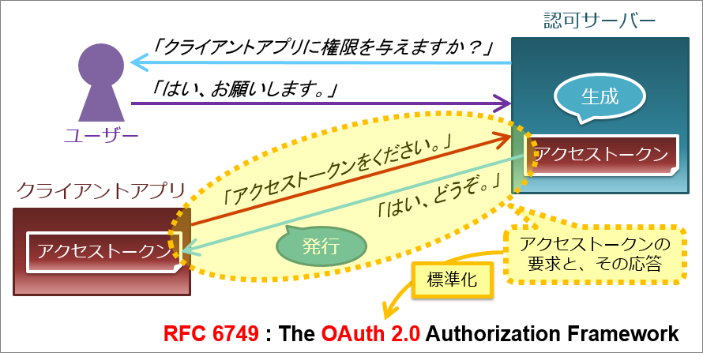
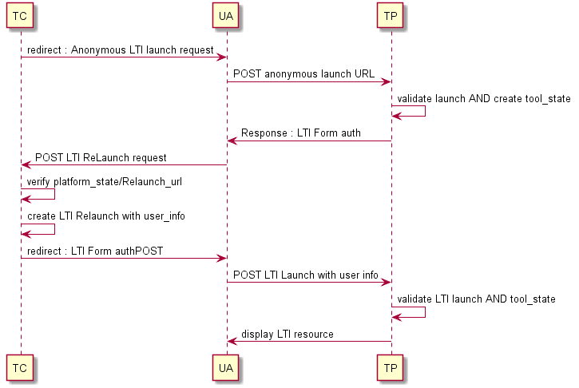
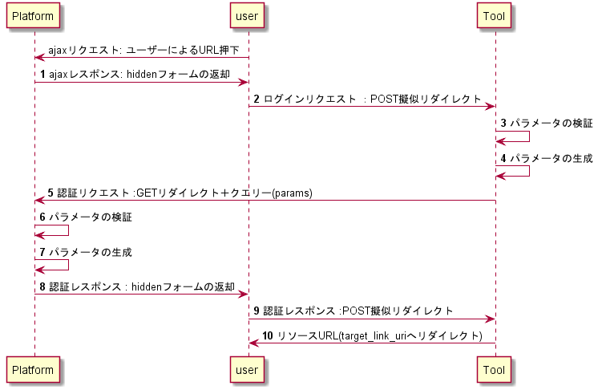

# LTI(Learning Tools Interoperability)について 
# 目次
[1.概要](#1.概要)  
[2.関連技術](#2.関連技術)  
[3.LTIv1.1.1](#3.LTIv1.1.1)  
[4.LTIv1.1.2](#4.LTIv1.1.2)  
[5.LTIv1.3](#5.LTIv1.3)  

# 1. 概要  
LTI(Learning Tools Interoperability)とは、[IMS Global Learning Consortium](http://www.imsglobal.org/)(以降IMS)が策定した、LMS(Learning Management System)と学習ツール(何らかの教材やサービスを提供)間で、やり取りする為のプロトコルである。(図１参照)  
要は、eラーニングシステムで使用される通信規約(通信データ構造等に関する)。
このLTI仕様はバージョンがあり、詳細は後述のセクションで解説するが、以下の様なものがある。  
また、LTIが使用されるシステム構成例(図１)も併せて記載する。  

|バージョン|関連技術|
|:--|:--|
|LTIv1.1.1|OAuth1.0を採用|
|LTIv1.1.2|OAuth1.0＋v1.1.1のセキュリティ強化版|
|LTIv1.3|OAuth2.0を採用|

| |
|:--:|
||
|図１.LTI 概要図|


|名称|内容|備考|
|:--|:--|:--|
|Tool Provider(ツール)|学習ツール(教材)を提供するサーバ|v1.3では"ツール"へと定義変更|
|Tool Consumer(プラットフォーム)|LMS。ユーザーはLMS経由で学習ツールを使用する|v1.3では"プラットフォーム"へと定義変更|
|LTI Service|LTIプロトコルの事|この中に何度もリダイレクトによるやり取りがある|
|User/Instructor/Admin|利用者(ブラウザ)、エンドユーザー||


# 2. 関連技術
### LMS(Learning Management System)
学習教材の配信や成績などを統合して管理するシステムの事。   
eラーニングにおけるプラットフォーム(OS)の様な役割。
 (あくまでメインは受講情報などの管理である為、教材(コース)は別のツールで作成されたものを利用することも多い。勿論LMSでテストなどの教材は作成可能)  
 具体的な機能としては、大まかに以下の様なものを備えている。
 - 受講ユーザー管理、教材管理
 - 教材の提供・配信
 - 受講履歴、進捗

|LMS名|備考|
|:--|:--|
|Moodle|かつてのNo1。今は使いづらいと評判悪い|
|Canvas|現在のシェアNo1|
|Sakai|謎|

### SCORM(Shareable Content Object Reference Model)  
eラーニングにおける標準規格であり、異なるLMS上で教材を扱う為の仕様である。
各社独自規格のLMS上で、教材を共有できるようにする為のインターフェース的な役割。  
LTIはツール側にアクセスして、ツール側のサーバで実行されるのに対し、SCORMは教材自体をプラットフォーム側(LMS)にもってきて実行するイメージ。
仕組みは大きく分けて以下の通り。  
1. ランタイム環境  
  LMSで用意されるAPIアダプタ。  
  学習コンテンツとLMS間で履歴データをやり取りする為の仲介役。  
  (学習コンテンツとLMSで直接やり取りしない)    
  つまりLMSが変わっても、各LMSで提供するAPIアダプタはSCORM仕様に従っている為、学習コンテンツ側は改修の必要がない。  
  
2. コンテンツアグリゲーション  
  学習コンテンツを流通させる為の情報(検索や再利用性)に関する定義(XML)。   
  XMLの内容は、関連キーワードや製作者、バージョン、紹介文などの情報。   
  XMLと学習コンテンツをzipでパッケージングして、LMSに登録する。  
  こうすることで、SCORM準処のLMSであれば教材を流用できるといった感じ。
  具体的な流れは、以下の通り。
    - 規定のXMLフォーマットに記入する。
    - XMLファイルを学習コンテンツと一緒にパッケージングし、LMSに登録する。
    - LMSが登録されたXMLを解釈し、教材情報一覧を生成する。
    - LMSは上記の登録情報から、目的に合った教材を抽出し、実行する。

### OAuth1.0/2.0
ざっくり言うと認可に関する規定。  
"1.0"は署名が必要であり、脆弱性有り。  
"2.0"はSSL/TLSが採用され、署名の必要がなくなった。  
OAuth1.0と2.0の互換性はないが、共存は可能である。[https://openid-foundation-japan.github.io/rfc6749.ja.html#anchor3](https://openid-foundation-japan.github.io/rfc6749.ja.html#anchor3)
クライアントがOAuthサーバーよりアクセストークンを受取り、これを元に認可サーバで認可を受けてリソースを受け取る。

| |
|:--:|
||
|図2.OAuth2.0 構成図|　


上図のフローを文章で書くと以下の通り。  
1. ユーザーがクライアントアプリへリクエストを投げる。  
2. クライアントアプリが認可サーバーへ「アクセストークン」発行依頼
3. 認可サーバーが、ユーザーへ承認依頼(ログイン画面表示)
4. ユーザーが承認(ログイン)したら、認可サーバーがアクセストークンを発行し、クライアントに渡す。
5. 以降、ユーザーはクライアントアプリにアクセス(リクエスト)する時、アクセストークンを一緒に渡す事で、リソースを受け取ることができる。(裏ではクライアントアプリが都度認可サーバにアクセストークンの確認(照合)をしている)

なお、認証は含んでいない為、認証もサポートしたければOpenID Connectを使う。
(OAuth2.0にOpenIDという認証トークンが追加されたようなもの)

### Base64
元の文字列を特定の文字コード表の64文字に、変換したもの。  
Basic認証(「ユーザーID、パスワード」をBase64でエンコして使う基本認証方式)で使われている為、暗号化と誤解している人が多いらしいが、あくまでエンコードであり暗号化ではない点に注意。  
具体的には、以下の手順で行われる。
```
1. 元の文字列をバイナリにして、6bit区切りにする。
   => 001101 111111 001001 110111 ........

2. Base64の文字コード表に従って、各6bitに対応した文字に変換する。
   => N/J3 .........
```   
6bit...即ち64文字だからBase64らしい。  
ただ、末尾埋めが必要な場合に"="が使われる為、正確には65文字で表現される。

### JWT(JSON Web Token)
jsonをトークンとして扱う仕様。OAuth2.0及びOpenIDで使われている。  
Header(ヘッダ情報)、Claim(ペイロード)、Sigunature(署名)の3ブロックでわかれており、`Header.Claim.Signature`といったピリオド区切りの文字列構成となっている。  
(※jsonがBase64でエンコードされて"."区切りの文字列になっている)  
使用時のフローは以下の通り。(OAuthの場合)  
- 認可サーバ側で、トークン(JWT)を発行し、OAuthクライアントに渡す。  
- クライアントのlocalStrage(sessionStrage)にJWTを保管する。
- 認可が必要な時にHTTPヘッダーのAuthorizationにJWTトークンを付加しリクエストを行う。
- 認可サーバ側(もしくはSP？)でヘッダーに付属しているJWTを検証する事で認可を行う。  
メリットとしては、サーバー側のストレージを消費しないことがあげられる。ただ、仮にトークン情報が奪われたときにsessionの様に即座に無効にすることが出来ない。
対策として有効期限を短めに設けるなどあるが、それでも有効期限の間は攻撃を受けることになる。  
当然ながら使用は、HTTPS前提。


トークンのそれぞれの項目は以下の通り。  

|項目|内容|
|:--|:--|
|Header|使用アルゴリズムが書かれている。中身は２項目くらいしかない|
|Claim|送信されるデータ。鍵が入っていたり、自由に追加したりできる。|
|Signature|Header指定のアルゴリズムで行った署名|

# 3. LTI v1.1.1
古いLTI仕様。OAuth1.0採用の為、脆弱性有り。  
公式の[ここ(https://www.imsglobal.org/specs/ltiv1p1p1/implementation-guide)](https://www.imsglobal.org/specs/ltiv1p1p1/implementation-guide)が分かりやすい。 


# 4. LTI v1.1.2  
IMSがOAuth1.0aのSHA-1使用を非推奨とした。これにより2019年いっぱいでLTIv1.0とv1.1仕様の認証は不可となる。  
v1.3へのアップグレードが推奨ではあるが、延命措置としてIMS Security Frameworkをレガシーバージョンに反映した、v1.0.1/v1.1.2といったセキュリティ更新verがある。  　　
このセキュリティ更新を行ったものがv1.1.2である。  

以降、このセキュリティ更新パッチについて記載する。  

### 起動フロー 




- 最初の起動は匿名であり、ID情報は含まれない。トークンをTC側へ返せるようにrelaunch_uriを含む必要がある。
- TPは匿名起動要求を受け取った後、検査を行い問題なければtool_state(XSRF)といったID情報すなわちトークンを発行する。

##### 匿名起動リクエスト(TC -> UA(ブラウザ) -> TP)
ユーザーがTPを起動する場合、TCはUAをTPへリダイレクトするリソース要求フローを開始する。リダイレクトはPOSTフォームで行う。  
この要求に含むパラメータは、標準のLTIパラメータに加えて、以下の通り。  

|パラメータ|内容|要否|
|:--|:--|:--|
|relaunch_url|再度起動を行うためのurl。ユーザーが確定されている再起動トリガー。|必須|
|platform_state|TCが生成するltiメッセージを識別する為の文字列。メッセージによって異なる。例えば、リソースリンク要求の場合はresouce_link_idとなる|必須|  

##### 再起動リクエストorリダイレクト
TPからTCへの認証リクエストを行うフロー。  
前述の匿名起動パラメーターチェックが問題なければ、TPはXSRFトークンを発行し、tool_stateパラメータにバインドする。  
その後、次のパラメータを用いてrelaunch_urlにリダイレクトまたはPOST送信を行う。(署名の必要はない)

|パラメータ|内容|要否|
|:--|:--|:--|
|tool_state|TCがリクエストとコールバックの状態を維持し、CSRFを軽減するための文字列。後にTPはこの値をチェックすることで元の匿名起動要求をしてきたTCであることを判断する。|必須|
|platform_state|最初の匿名起動に含まれる場合にセットする必要がある|※必須|

##### 再起動レスポンス(リクエストorリダイレクト)
TCは、現在ログイン中のユーザーがリクエストと一致し、platform_stateがそのユーザーに対して有効である事が検証できたら、以下のユーザー情報などのを含むLTI起動を構築する。  
認証応答はLTI起動URLに送信される。

|パラメータ|内容|要否|
|:--|:--|:--|
|user_id|ユーザー情報||
|roles|ユーザー情報||
|lis_person_name_given|ユーザー情報||
|lis_person_contact_email_primary|ユーザー情報||
|tool_state|TPがLTI再起動要求を元のTP発行tool_stateと検証する為に必要|必須|


##### LTIリソースの表示
LTI起動パラメータを検証し、tool_stateが一致することが確認できれば、LTIリソースを表示する。


# 5. LTI v1.3
※詳細は以下公式を参照
- [IMS Security Framework](https://www.imsglobal.org/spec/security/v1p0/)
- [LTI v1.3仕様](https://www.imsglobal.org/spec/lti/v1p3/#platforms-and-tools)
- [LTI Assignment and Grade Services](https://www.imsglobal.org/spec/lti-ags/v2p0/)
- [LTI Deep Linking Specification](https://www.imsglobal.org/spec/lti-dl/v2p0/)
- [LTI Advantage Conformance Certification Guide](https://www.imsglobal.org/spec/lti/v1p3/cert/)

### 用語  
- IRI(Internationalized Resource Identifier)  
  URIの代わりに使用できる(URIの拡張版)、文字シーケンス(RFC3987参照)  
- LIS(Learning Information Services)
  人、グループ、コース、結果などの情報交換をシステムが管理する方法を定義したIMS標準。
- LTI
  教育環境内での豊富な学習アプリケーション統合のためのIMS標準
- URI(Uniform Resource identifier)
  US-ASCII文字セットを使用したリソースの識別子。URLやURNはURIのサブスペースである。
- URL(Uniform Resource Locator)
  リソースの場所とその表現を取得する手段の両方を指定するリソースへの参照を提供するURIの一種。  
  HTTP URI==URL
- URN(Uniform Resource Name)
  定義済みの名前空間にばいどされているリソースの永続的な識別子を提供するURIの一種。URLと違い、場所に依存せず、アクセス手段を提供しない。
- UUID
  一意性を保証する登録機関を必要としない128ビットの識別子。衝突率は低いが絶対ではない。LTIではUUID v4を推奨。

### ドキュメント一覧
- LTI Advantage適合認定ガイド
    - MS認定テストスイートによるLTI1.3及びAdvantageサービスに対してプラットフォームとツールをテストする手順について記述されている。 
- JSONスキーマ
    - 基本的なLTIメッセージのペイロードの形式を定義するjsonスキーマ。

### LTIドメインモデル  
[IMS公式](https://www.imsglobal.org/spec/lti/v1p3/#platforms-and-tools)の3.1.2項参照。  
以降で説明するパラメータが何のパラメータなのか一目でわかるので要参照。

### 主要な概念・要素
1. プラットフォーム  
従来のToolConsumerの事。(Moodle,CanvasなどのLMS)  
また、OpenIdのプロバイダーとしても機能する。

1. ツール  
従来のToolProvierの事。(LMS上からアクセスする学習ツール,教材) 

1. Consumer (IMS Security Framework定義) 
エンドユーザーがプラットフォームを通してアクセスするエンティティ。  
基本的にはツールと考えてよさそう。  
※実際は、状況に応じて変わる為注意。

1. ツールのdeployment  
"ツールのdeployment"はプラットフォーム上における、ツールが使用可能なコンテキストの範囲を定義する。  
プラットフォーム(LMS)は展開されたツールに一意なdeployment_idを生成する。ツールのインスタンスみたいなもの。  
対して、ツールそのものの識別子は"client_id"であり、これはツールごとに一意である。

1. LTIリンク  
プラットフォームに保存されている特定のツールへの参照である。
LTIリンクのmessage_typeに依存する、リソースを提供するツールへのリンク。  
LTIリンクは、ツールを指すURLと、各リンク固有の識別及び表示目的で使用される他メタデータが含まれている。  
(つまるところ、URL＋関連するメタデータ)  
LTIリンクはリンク先を識別する為にdeployment_idに紐づけられている。  
また、特定のリソースに接続された各LTIリンクは"resource_link_id"というプラットフォーム固有の識別子を含む必要がある。(=>リソースリンクと呼ぶ)

1. LTI Launch(起動)  
ユーザーがLTIリンク(リソースリンク)を押下し、ツールを「起動」するプロセスの事。  
LTIにおけるプラットフォームとツールは、メッセージペイロードを含む"message"をやり取りする為に、HTTPのリダイレクトPOSTフォームを使う。  
このペイロードのデータは"message_type"で決められている。

1. message  
ユーザーがLTIリンクを押下した後、プラットフォームはOpenIDでログインフローを開始し、最終的にプラットフォームはLTIメッセージ(id_token)をツールに渡す。この時受け渡しされるトークンの事。OAuth2.0のJWTが一般的。  
その為、データ暗号化が必要であり、TLSを使用する事となっている。なお、SSL証明書の交換については仕様で定義されていない。

1. service  
ツールがプラットフォームに直接アクセス(又はその逆)する場合の、接続サービス名の事。ブラウザを使うユーザーに仲介されない、RESTの様なWebサービスの事。HTTPSで実装する。

1. Line item
プラットフォームの成績表の列のこと。ユーザーのアクティビティに関連付けられた結果を保持する。  
アクティビティはLTIコンテキストと関連づけられる為、コンテキストとLine itemの間には1対多の関係が成り立つ。  

1. Line item container
Line itemを配列として持っているもの。  
DBにおけるテーブル相当と思ってよさそう。

1. Result
プラットフォーム成績表のセル。つまりあるLine itemの値。　　
ユーザーとline itemに一意である。  
値として、数値型の"SCORE"と"コメント"を持つ。  
Line itemが作成されたときのステータスは"Initialized"。  
プラットフォームは変更履歴を維持するが、ResultのGETリクエストを受けたときは、最新のresultを返す。

1. Score
ツールを受講した学生が得た最終的なスコア。  
また、現在の活動ステータス(完了か未完か)もある。  
スコアはツールから、Score Serviceを使用しているプラットフォームに送られる。
プラットフォームは現在の値(gradebook中に示される値)
を受けとった値に変更する。  

1. Score container  
与えられたLine itemに更新スコアをpushする為のエンドポイント。


### LTIフロー (プラットフォーム起動のメッセージ) 

||
|:--:|
||
|図3. LTI v1.3 処理フロー|  

利用するパラメータは以下の仕様に従う。
- [IMS Security Framework](https://www.imsglobal.org/spec/security/v1p0/#step-1-third-party-initiated-login)の5項で定義されているパラメータと、
- [LTIv1.3](https://www.imsglobal.org/spec/lti/v1p3/#lti-message-general-details)で定義されている追加パラメータ。  

以降に上図３を元にした、実フロー解説を記載する。(項番は図と連動)

##### 1. ajaxリクエスト/レスポンス  
=> ユーザーがプラットフォーム上でツールの起動を行った時(コースの受講、URL押下など)、LMSからパラメータの取得を行う。(今回はajaxとして話を進める)
このajaxで返されるレスポンスは、各LTIパラメータがセットされたhiddenなinput要素を含むForm要素である。
レスポンスの読み込み後(Formロード後)、javascriptのsubmit()で擬似的なPOSTリダイレクトを行う。(=>後述の2. ログインリクエストへ)  
Formで返却されるパラメータは以下の通り。

|パラメーター名|内容|パラメータ要否|事前登録(ツール)|
|:--|:--|:--|:--|
|iss|LMSの識別子。特に指定はないが、LMSのベースURLが使われる。|必須|必須|
|login_hint|エンドユーザーがログインに使うかもしれないログイン識別についてのサーバー認証のヒント。|必須|-|
|target_link_uri|OpenID Connectによる認証の最後に実行すべきエンドポイント。要は認証成功時のリソースアクセス先|必須|-|
|lti_message_hint|login_hintの補佐的なパラメータ。無くても良いが、送られてきた場合は以降も追加しなければならない|オプション|-|


以上の様に、プラットフォームがログインエンドポイント(ツールもしくは別の認可サーバ)にユーザーをリダイレクトすることによって、OpenId Connectフローが開始される。
このリダイレクトは"GET"or"POST"どちらでも良い。(仕様では決められていない)

##### 2-4. ログインリクエスト～検証～パラメータ生成
=> 1項でPOST送信されたログインリクエストのパラメータ検証を行う。
検証は、以下の要領で行う。
- iss
  - DBで、issを条件にレコード検索を行う。(存在チェック兼、他事前登録情報の取得)
- login_hint
  - 存在チェックのみ行う。
- target_link_uri
  - 存在チェックのみ行う。
- lti_message_hint
  - 含まれている場合は後述の認証リクエストに含める。  

検証が問題なければ、以下のパラメータ生成を行う。  

|パラメーター名|内容|パラメータ要否|事前登録(ツール)|
|:--|:--|:--|:--|
|scope|定数="openid"|必須|-|
|response_type|定数="id_token"|必須|-|
|client_id|登録済みのクライアントID|必須|必須|
|redirect_uri|登録済みのリダイレクトID|必須|必須|
|login_hint|ログインリクエストと同じ値|必須|-|
|state|CSRF対策のランダム文字列。リクエストとコールバック間の状態を維持する|推奨|-|
|response_mode|定数="form_post"|必須|-|
|nonce|クライアントセッションをIDトークンに関連付け、リプレイ攻撃を軽減する為の文字列。|必須|-|
|prompt|定数='none'|必須|-|
|lti_message_hint|ログインリクエストと同じ値。ない場合は項目自体いらない|オプション|-|  

前述で取得したDBレコードの内「LMSの認証URL」にクエリーストリングとして上記パラメータを
セットして、リダイレクト(GET)を行う。(5. 認証リクエストへ)

##### 5-7. 認証リクエスト～検証～パラメータ生成
=> 2項で生成したパラメータの検証を行う。Moodle側なので詳細は不明だが、以下の要領で行われているはず。

- client_id
  - LMS側のものと比較
- redirect_uri
  - 送られてきたredirect_uriがclient_idの有効なURLであることをチェック

パラメータ検証が問題なければ、以下のパラメータ生成を行う。  

|パラメーター名|内容|要否|
|:--|:--|:--|
|id_token|後述するJWT文字列。JWTには、LTI仕様で決められたパラメータ以外の他メッセージclaimsを含むこともある。(カスタムパラメータ?)|必須|
|state|認証リクエストで受け取ったものがそのまま入る。|必須|  

上記パラメータをセットしたinput[type="hidden"]を含むForm要素をレスポンスとして返す。　　
そして、ツールのredirect_uri(本項最初で受け取ったパラメータ)へ向けてjavascriptでPOST擬似リダイレクトする。(8.認証レスポンスへ)

##### 8-9. 認証レスポンス
=>　3項の認証リクエスト後に擬似リダイレクトで送られてきたパラメータを以下の要領で検証する。
- error
  - パラメータが存在しないことを確認
- state
  - 値が認証リクエスト送信時の値と同じである事を確認
- LMSから公開鍵を取得して、Base64でデコードしたJWTの署名検証を行う。(※詳細は後述)
  "ツール⇒LMSへ"GETリクエストを行う。
  - リクエスト先URLは、DBに事前登録したURL(公開鍵を提供するLMS側のエンドポイント)
  - デコードしたJWTヘッダのKidをクエリーストリングとしてリクエストに付ける  

検証が問題なければ、リソース(target_link_uri)へリダイレクトさせる。(10.リソースの表示へ)

##### 10. リソースの表示  
=> target_link_uriへリダイレクトさせ、リソースを返す。

##### 認証エラー応答
各検証におけるエラーメッセージもOpenId Connectで仕様が決められている為従う事。

### 認証レスポンスの検証詳細(JWT)
- 公開鍵を使って、プラットフォームから受信したJWT「id_token」のsignatureが一致するか検証する。
- id_token中の"iss"が、最初のログインリクエストで送られてきたissと同じか確認する。
- id_token中の"aud"とclient_idと一致するか確認する。これが一致しない場合は、id_tokenを拒否し、httpステータス401を返す。
- azpがclaimに含まれているなら、ツール側は全てclient_idとのチェックを行う。
- alg値は、デフォルトで"RS256"である。違うアルゴリズムだと相互運用性が制限される為、RS256を推奨。
- 現在のシステム時刻が、"exp"であらわされる時刻より前でなければならない。(こちらはid_token自体のtimestamp。後述のものはnonceに対しての時間)
- iat値は、nonceを格納できる制限時間を示す。この時刻が現在時刻から離れすぎていないことを検証する。(時間は任意？)
- id_token中にnonceが含まれている場合、これを認証リダイレクト前に生成したものと検証する。

エンドユーザーの認証に使用されるid_tokenの構造は以下の通り。
(※必須のみ抜粋)
```json
//id_token例
id_token{
    "iss": "https://lms.uofexample.edu",             // LMSの識別子。
    "sub": "24400320",                               // ユーザー識別子
    "aud": "s6BhdRkqt3",                             // client_id
    "nonce": "n-0S6_WzA2Mj",
    "exp": 1311281970,
    "iat": 1311280970
}, ....

```

|パラメーター名|内容|要否|
|:--|:--|:--|
|iss|LMSの識別子。最初に送ったやつ|必須|
|aud|client_id。これも最初に送ったやつ|必須|
|sub|プラットフォームのユーザーID|必須|
|exp|id_tokenの有効期限。推奨値は3600(=1時間)|必須|
|iat|JWTを生成した時刻。|必須|
|nonce|ワンタイム値。以前に発行したもの|必須|
|azp|複数のaud。|必須|

プラットフォームから送られてくるJWTのパラメータは、正確には以下の様になるがほとんどがオプションである為、前述の必須項目を検証するようにしておけば仕様上は問題なし。
後述のサービスなどを使うのであれば、当然ながら必要なパラメータが増える。

```json
{
  "https://purl.imsglobal.org/spec/lti/claim/message_type": "LtiResourceLinkRequest",
  "given_name": "Mr.",
  "family_name": "Torp",
  "middle_name": "Dominque",
  "picture": "http://example.org/Mr..jpg",
  "email": "Mr..Torp@example.org",
  "name": "Mr. Dominque Torp",
  "https://purl.imsglobal.org/spec/lti/claim/roles": [
    "http://purl.imsglobal.org/vocab/lis/v2/membership#Learner",
    "http://purl.imsglobal.org/vocab/lis/v2/institution/person#Student",
    "http://purl.imsglobal.org/vocab/lis/v2/membership#Mentor"
  ],
  "https://purl.imsglobal.org/spec/lti/claim/role_scope_mentor": [
    "a62c52c02ba262003f5e"
  ],
  "https://purl.imsglobal.org/spec/lti/claim/resource_link": {
    "id": "6650",
    "title": "naoe-tool course",
    "description": "External tool \"Naoe tool\""
  },
  "https://purl.imsglobal.org/spec/lti/claim/context": {
    "id": "2044",
    "label": "course-labale",
    "title": "course-title",
    "type": [
      "movie"
    ]
  },
  "https://purl.imsglobal.org/spec/lti/claim/tool_platform": {
    "name": "Naoe Test",
    "contact_email": "",
    "description": "",
    "url": "",
    "product_family_code": "",
    "version": "1.0",
    "guid": 484
  },
  "https://purl.imsglobal.org/spec/lti-ags/claim/endpoint": {
    "scope": [
      "https://purl.imsglobal.org/spec/lti-ags/scope/lineitem",
      "https://purl.imsglobal.org/spec/lti-ags/scope/result.readonly",
      "https://purl.imsglobal.org/spec/lti-ags/scope/score"
    ],
    "lineitems": "https://lti-ri.imsglobal.org/platforms/484/contexts/2044/line_items"
  },
  "https://purl.imsglobal.org/spec/lti-nrps/claim/namesroleservice": {
    "context_memberships_url": "https://lti-ri.imsglobal.org/platforms/484/contexts/2044/memberships",
    "service_versions": [
      "2.0"
    ]
  },
  "https://purl.imsglobal.org/spec/lti-ces/claim/caliper-endpoint-service": {
    "scopes": [
      "https://purl.imsglobal.org/spec/lti-ces/v1p0/scope/send"
    ],
    "caliper_endpoint_url": "https://lti-ri.imsglobal.org/platforms/484/sensors",
    "caliper_federated_session_id": "urn:uuid:73b41a2da4a27263a7a7"
  },
  "iss": "https://lti-ri.imsglobal.org",
  "aud": "naoe-client-id",
  "iat": 1568953213,
  "exp": 1568953513,
  "sub": "5424b3b826dd82c8a52b",
  "nonce": "935877deba8728d1cadb",
  "https://purl.imsglobal.org/spec/lti/claim/version": "1.3.0",
  "locale": "en-US",
  "https://purl.imsglobal.org/spec/lti/claim/launch_presentation": {
    "document_target": "iframe",
    "height": 320,
    "width": 240,
    "return_url": "https://lti-ri.imsglobal.org/platforms/484/returns"
  },
  "https://www.example.com/extension": {
    "color": "violet"
  },
  "https://purl.imsglobal.org/spec/lti/claim/custom": {
    "myCustomValue": "123"
  },
  "https://purl.imsglobal.org/spec/lti/claim/deployment_id": "1",
  "https://purl.imsglobal.org/spec/lti/claim/target_link_uri": "https://lti-ri.imsglobal.org/lti/tools/490/deep_link_launches"
}
```

### LISサービス
##### 1. 概要
プラットフォームのLTIコンテキスト内で利用できる機能のこと。  
この機能(サービス)群をLIS(Learning Information Service)という。  
LISサービスはUA(ブラウザ)を介さず、サーバ間で直接やり取りする。  

||
|:--:|
||
|図.サービスフロー|

前述LTI起動メッセージで送られてくるJWTに、LMSのコンテキストで許可されている"権限"及び"LISサービスのエンドポイントURL"が入っている。  
以下の様な感じ。

```json
//resource_link経由でLineitemとやり取りする場合...(Lineitemが一つの場合)
"https://purl.imsglobal.org/spec/lti-ags/claim/endpoint": {
  //権限
  "scope": [
    //Lineitemの追加、削除、照会全てのの許可
    "https://purl.imsglobal.org/spec/lti-ags/scope/lineitem",
    //Lineitemの照会許可(GETのみ)
    "https://purl.imsglobal.org/spec/lti-ags/scope/result.readonly",
    "https://purl.imsglobal.org/spec/lti-ags/scope/score"
  ],
  //サービスエンドポイントのURL(Lineitemコンテナ)
  "lineitems": "https://www.myuniv.example.com/2344/lineitems/",
  //　〃　(resource_linkと紐づいているLineitem)
  "lineitem": "https://www.myuniv.example.com/2344/lineitems/1234/lineitem"
}

```

```json
//Lineitemコンテナと直接やり取りする場合...
"https://purl.imsglobal.org/spec/lti-ags/claim/endpoint": {
  "scope": [
    "https://purl.imsglobal.org/spec/lti-ags/scope/lineitem",
    "https://purl.imsglobal.org/spec/lti-ags/scope/result.readonly",
    "https://purl.imsglobal.org/spec/lti-ags/scope/score"
  ],
  "lineitems": "https://www.myuniv.edu/2344/lineitems/"
}
```


##### 2. Line itemサービス
Line itemを操作する機能。JWT中の"～/endpoint"パラメータ内にエンドポイントがある。  
- LineItems.url : 現在のコンテキストのLineitemコンテナにアクセスするエンドポイントURL
- LineItem.url : リソースリンクに紐づいているLineitemが1つしかない場合、そのLineitemにアクセスする為のエンドポイント。複数ある場合は、このプロパティは空白となる。  

詳細は後述するが、サービスリクエストは対象がLineitemかLineitemsかによって以下の通り異なる。
```json
//'application / vnd.ims.lis.v2.lineitem + json'の場合...  
{
   "id"："https://lms.example.com/context/2923/lineitems/1"、
   "scoreMaximum"：60、
   "label"："Chapter 5 Test"、
   "resourceId"："a-9334df- 33 "、
   " tag "：" grade "、
   " resourceLinkId "：" 1g3k4dlk49fk " 
  " startDateTime "：" 2018-03-06T20：05：02Z " 
  " endDateTime "：" 2018-04-06T22：05：03Z " 
}
```

```json
//'application / vnd.ims.lis.v2.lineitemcontainer + jsonの場合...
[{
         "id"："https://lms.example.com/context/2923/lineitems/1"、
         "scoreMaximum"：60、
         "label"："第5章テスト"、
         "resourceId"："a-9334df -33 "、
         " tag "：" grade "、
         " resourceLinkId "：" 1g3k4dlk49fk " 
        " endDateTime "：" 2018-04-06T22：05：03Z " 
    }、
    { " id "：" https：//lms.example。com / context / 2923 / lineitems / 47 " 、
         " scoreMaximum "：100
        、
         「label」：「第5章の進捗状況」、
         「resourceId」：「a-9334df-33」、
         「tag」：「originality」、
         「resourceLinkId」：「1g3k4dlk49fk」 
    }、
    { 「id」：「https：// lms.example.com/context/2923/lineitems/69 "、
         " scoreMaximum "：60、
         " label "：" Chapter 2 Essay "、
         " tag "：" grade "
    } 
]
```

##### 3. Resultサービス
Line itemの情報を取得するサービス。DBでいうSELECTに相当。
結果サービスを利用すると、ツールはプラットフォーム独自の項目について結果を照会できる。  
結果は、プラットフォームの成績表にある特定のユーザの現在の成績を表す。(LMS側の成績をツール側で使いたいときに使うサービス)  
ツールがプラットフォーム内の成績を直接変更するべきではない為、GETリクエストしかできない。
※Scoreと対のサービスの為、今回は詳細まで書かない。

##### 4. Scoreサービス
従来のOutcomeに相当する、受講結果の送信用サービス。
ツールにおける特定のLine itemのユーザーステータスを表す。(ツールでの受講結果)  
最新のスコアをプラットフォームに送る為のサービスである(書き込み専用)である為、GET操作はサポートされない。
プラットフォームのスコアサービスエンドポイントは、パスに「/score」が追加されたLine itemのURLである。  
サービスURL自体は、Line itemURLから取得される為、LTIメッセージには含まれていない。
HTTPメソッドはPOSTのみであり、メディアタイプとClaimsは以下の通り。

- application/vnd.ims.lis.v1.score+json' representation  
```json
{
  "timestamp": "2017-04-16T18:54:36.736+00:00",
  "scoreGiven" : 83,
  "scoreMaximum" : 100,
  "comment" : "This is exceptional work.",
  "activityProgress" : "Completed",
  "gradingProgress": "FullyGraded",
  "userId" : "5323497"
}
```
上記値にも条件がある(正数であるとかLTIパラメータとおなじだとか)為、実装時は要確認。

### LTI起動フロー(ツール起動のメッセージの場合）※今回は適用外
ツール発信のメッセージの場合は、JWTを送る。
送られるメッセージの概要は以下の通り。
- ツールには、OAuth2.0のclient_idをセットする。(LMS側で事前発行されたものを登録しておく)
- プラットフォームに、ツールの秘密鍵に対応する公開鍵とツールのclient_idを登録しておく
- ツールはプラットフォームのiss(LMS識別子)を登録しておく必要がある
- ツールは秘密鍵を持っている必要がある

##### Form Parameter
送信側は、HTTP POSTフォームの1つのパラメータにJWTをつけて送る。(key名=値　=> "JWT"=JWT値をPostフォームする)
JWTはJWS署名されたトークンをメッセージclaimsに含む。
JWSはツールの公開鍵で生成される。

##### 認証応答の検証

次の通り
- ツールの公開鍵を使って、JWTを検証する。
- ツールのclient_idが、claimsと一致するか確認
- audのURL(LMS自身を指すURL)をチェック
- expの有効期限内であることを確認
- iatの値をexpとの比較で使う
- nonceの値をチェック
- azpの値をチェック。

```json
id_token{
     "iss"："s6BhdRkqt3"、                                //ツールのclient_id
    "aud"："https://lms.uofexample.edu"、                //プラットフォーム識別子(URL)
    "nonce"："n-0S6_WzA2Mj"、
     "exp"：1311281970、
     "iat"：1311280970 
}     

```

### 実装注意点
- exp値(アクセストークン(id_token)の有効期限)推奨値は3600(1時間)
- LTI v1.3ではTLS v1.2を採用
- JWTで使用する鍵は非対称キー(公開/秘密鍵)を推奨
