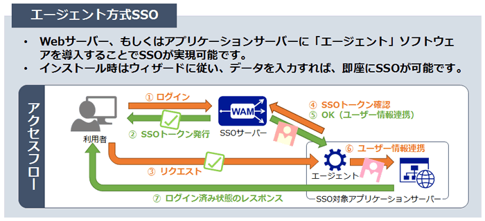
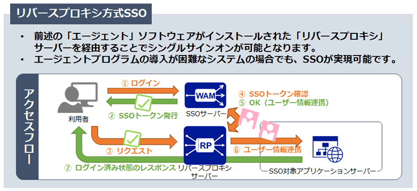
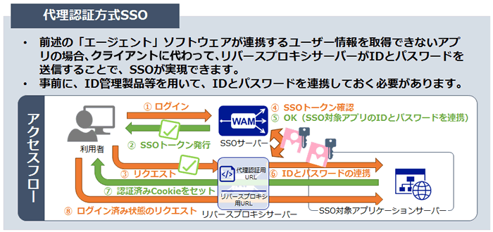
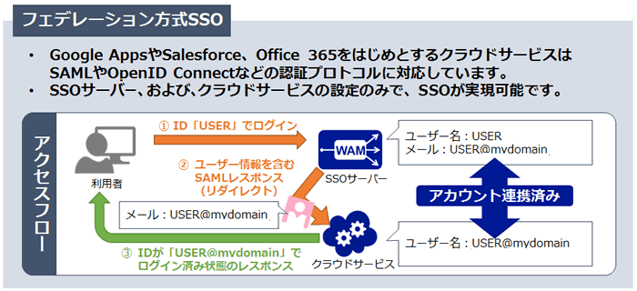

# SSO(シングルサインオン)
# 概要 
SSO(シングルサインオン)の概要から関連技術についてまとめる。(構築手順は頑張りたい...)

# 目次
[SSO概要](#SSO概要)  
[SSO仕組み](#SSO仕組み)  


# SSO概要
SSOの仕組み自体は、一度の認証のみで複数のサービスにアクセスできる、といったよくあるやつ。

メリットは、以下の通り。
- 単純にログイン施行回数が減る事。  
- １つのパスワードで済むので長めのパスにして管理できる  
  - ビジネス用語で「リソースの選択の集中」なんて言うらしい。 
  - 英数字の小文字・大文字区別ありで10文字の場合、総当たり攻撃では理論上20万年かかるらしい。記号も足せば1000万年との事)   
- 社員にパスワード(クラウドサービスの)を教えずに済む(リスク低減)
  - 各クラウドサービスへのパスワードは管理者が一括管理
  - 社員は、SSOのパスワードのみ与えられる  

デメリット以下の通り
- 構築がかなり面倒。
- セキュリティ面
  - パスワード長で強化されているとは言え、結局奪取されてしまえば終わりなので、他の認証機能も使う。(ワンタイムや静脈認証など)
- 管理システムに依存
  - SSOサーバがダウンすると、全サービスが利用できなくなる。
- 導入コスト
  - オンプレの場合、初期投資が当然ながら高い
  - クラウドのIDaaSもランニングコストかかる
- 連携出来ないサービスがある
  - 独自認証の場合、標準仕様に対応していない場合があり、SSO利用不可なことも(特に日本国内サービス)


# 基本用語
### Identity Provider(IdP)　≒ OP(OpenIDにおける認証サービス提供者)
SSOにおける`認証情報を提供する側`の事。(OpenAMなど)
Idpに一度ログインする事で、OpenAMと連携しているSSO対象のWebアプリに認証情報の提供及び自動ログインが行われる。

### Service Provider(SP)  ≒ RP (OpenIDにおける認証サービス利用者)
SSOにおける`認証情報を利用する側`の事。(Webアプリなど)
Idpからクライアントの認証情報を受け取り、ユーザーからのアクセスを直接のID/パスワード入力無しで許可する。

### ADFS(Active Directory Federation Services)
AD(Active Directory)と、クラウド上に構築されたADFSサーバ(=Idp)を連携させることで、
Ofice365等のクラウドサービス(=SP)に対してSSOを実現する。
(Windows限定っぽいけど、解説とかでよく出てくるので記載。もしかしたらSambaもいける？)

### LDAP(Lightweight Directory Access Protocol)
ユーザーやコンピューターの情報を集中管理する「ディレクトリサービス」(AD等)へのアクセス時に用いられるプロトコル。

### レルム
ユーザー、グループ、関連するセキュリティー資格(アクセス権限)を含んだリポジトリの事。
「セキュリティポリシードメイン」とも呼ばれる。
ユーザー情報が入っているデータストアみたいなもの。

### DS(Discovery Service)
IdPを検索・選択するシステム。フェデレーションが運用。
ここに名前が載ることでフェデレーションに参加する事となる。


### OpenID
署名付き証明書(IDトークン)を発行するプロバイダーの事。認証のみ

### OAuth
認可に対応する為のプロトコル。OpenIDが認証のみの為、補完のために生まれた。

### OpenID Connect
OpenID + OAuthみたいなもの。SAMLと似ている。

### SCIM(System for Cross-domain Identify Management)
クラウドサービスにおけるID管理の仕様。  
ユーザー情報やグループ情報をJSONで表現し、HTTPでリクエスト/レスポンスを送受信する。(REST API)
認証・認可の仕組みが無いので、OAuth(公式の推奨)などと併用する。


# SSO仕組み
SSOには大きく分けて以下4種類の方式がある。  

### 1. エージェント方式
Webアプリケーションサーバに、**認証を代行する「エージェント」モジュールを組み込む**方式。  
Webサーバがリクエストを受け取り、Webサーバ内の「エージェントモジュール」がSSOサーバに問い合わせを行う。
同時ログイン数が数万人規模の組織の場合(会社始業時など)、オンプレミスでよく利用される。(前職は多分これ)  



### 2. リバースプロキシ方式
ブラウザ(クライアント)とWebアプリケーションサーバ間に「リバースプロキシ」を設置し、**リバースプロキシにエージェントソフトを導入する**方式。  
ブラウザからのリクエストをリバースプロキシで受け取り、認証確認を行ってから、Webサーバへ中継する。  


### 3. 代理認証方式
対象のWebアプリやクラウドサービスのログインページに対して、**ユーザーの代わりにID/パスワードを送信し、自動的に代理入力する**方式。  


### 4. フェデレーション方式
クラウドサービス間をパスワードの代わりに、**「チケット」と呼ばれる情報を受け渡してSSOを実現する**方式。(現在主流の方式)     



# SSOプロトコル
### 1. SAML(Security Assertion MarkUp Language)
SSOを実現する為のプロトコルの１つであり、XML形式で認証情報のやり取りを行う。。(現行ver SAML2.0)
Googleやサイボウズなどで実装されている為、信頼性が高い。  
最近は`OpenId`(概念はSAMLと同様)という規格も普及しているらしいが、まだまだSAMLも主流との事。
実際に設定する内容は大きく分けて２つ。
- ユーザー情報を共有するIdp及びSP間で標準メタデータ(証明書)。(トラストサークル)
- 両者間のユーザー情報紐づけ。(SPのユーザー情報とIdpのUIDが一致している必要がある為)  

設定フローは以下の通り
| 項目 | 内容 |
|:--|:--|
|事前準備|IdP用サーバーへOpenAM等のミドルウェアをインストール|
||IdP用サーバーのホスト名設定|
||IdP用サーバーの時刻同期設定|
||SPのドメイン取得(IPアドレス指定はダメらしい)|
|証明書の取得|SAML署名鍵と証明書の生成(多分CA発行のやつ。OpenAMなどはテスト用に付属しているが、実運用では使ったらおわりなのでちゃんと申請する事)|
|連携用ユーザーの設定|認証対象ユーザーの設定(内部または外部ユーザーデータストア)|
|SSO設定|IdPの構築(署名などの設定の事)|
||IdPへSPの接続登録|
||SP側のSSO設定(SAML IdPサーバーの登録やSSOを有効にする設定)|

#### SAML with "Spring Boot"
SpringSecurityでSAML認証を実装することができる。
要参照：https://docs.spring.io/spring-security-saml/docs/1.0.x-SNAPSHOT/reference/htmlsingle/
    
|名称|備考|
|:--|:--|
|spring-security|言わずもがな|
|spring-security-saml-core| SAML認証を利用する為のライブラリ|


- Java Config : 基本はSpring SecurityのconfigにBeanを追加する。※かなり多いので一部省略する
  - 
- SAMLUserDetailServiceの実装クラス
  - SAML認証情報受け取り時の動作を記述するクラス。
  - loadUserBySAML(SAMLCredential)でCredential(認証情報)を受け取っている。
  - まだいっぱい....


- application.yml(SAML用メタデータ)記載例
```yml
saml:
  idp:
    metadata:
      #認証情報やり取りに使用するxmlファイルのパスを指定
      path: /saml/xmlファイル名.xml　
    #認証情報を所有するIdpの絶対パス(モジュール名まで?)
    url: https://*******/****
    #謎
    nameid:
      format: なぞ
  sp:
    #SPの絶対パス
    baseurl: http://*****************:8080/コンテキストパス
    #SPの識別子。ユニークである
      entityid: <baseUrl>:8080/saml/metadata
  #暗号鍵に関する設定(SAMLではSSL利用必須の為)
  keystore:
    #暗号鍵の在処(バイナリファイルぽい)
    classpath: classpath:/saml/****
    #basedURLに紐づるエイリアス名を指定(拡張設定)
    alias: エイリアス
    password: パスワード
```


# SSOサーバソフトウェア
### 1. OpenAM
歴史的には、元々Sun MicroSystemsが開発していたOpenSSOが元であり、ForgeRockという所が引き継いだOSSらしい。
製品版もあるが、ソースコードは公開されていない。名前からもOpenが消えた6つの機能構成となっている。([公式参照](https://backstage.forgerock.com/))

大まかな機能は以下の通り。
- 認証機能
  - 20種類の認証方式(プロトコル)をサポート
  - SAML認証機能
  - [JAAS標準(Java Authentication and Authorization)](http://otndnld.oracle.co.jp/document/products/wls/docs92/security/fat_client.html)に基づいたカスタム認証モジュールを作成する柔軟性
  - [WindowsIWA](http://e-words.jp/w/%E7%B5%B1%E5%90%88Windows%E8%AA%8D%E8%A8%BC.html)をサポートし、OS依存の無いシームレスなSSO環境有効可(URL見た感じだとWindows限定な気がする..)
- 認可機能
  - XACML(XMLベースのマークアップ)に基づいた認可
- フェデレーション機能
- 監査ログ機能
- セッション管理
- 冗長構成が可能

#### OpenAM環境構築
- OpenAM/SAML  
  - インストール　https://www.openam.jp/wp-content/uploads/techtips_vol1.pdf
  - 設定手順　　　https://www.openam.jp/wp-content/uploads/techtips_vol2.pdf
- OpenAM/SAML（他例)  : https://kfep.jp/openam-news-2016-11-25-3388
- OpenAM/OpenIG　　　 : https://qiita.com/gzock/items/af6f820b5e872366e853  

#### OpenAM環境構築(やってみた)
環境は以下の通り
|項目|バージョン|
|:--|:--|
|CentOS7||
|Java|Java1.8.0_222|
|Tomcat| 9|
|OpenAM| 13.0.0|

1. CentOS設定  
以下の通り、各ファイル設定を行う。
```
# 「/etc/sysconfig/network」を以下の内容で編集。OpenAMサーバはFQDNである必要がある為
HOSTNAME = sso1.example.com
```
```
# 「/etc/hosts」hostsファイルの編集。
127.0.0.1 localhost
192.168.0.11 sso1.example.com sso1
```
```
# /etc/sysconfig/selinux　でSELinux無効にする。設定後、再起動必要
SELINUX = disabled
```

2. Tomcat設定(インストール後)
Tomcatインストール後、以下の設定を行う。
```

```


3. OpenAMインストール
    - [FORGEROCK](https://backstage.forgerock.com/downloads/search?q=openam)からOpenAM.warをDL。※DLには会員登録必要。
    - 


### 2. IDaaS(Identity as a Service)
クラウド型のシングルサインオンサービスの総称。
#### IDaaS運用
- OneLogin
  - SAML認証を利用　https://www.mubit.co.jp/pb-blog/?p=7436
