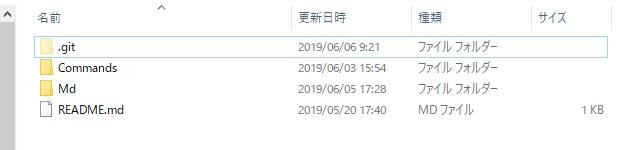
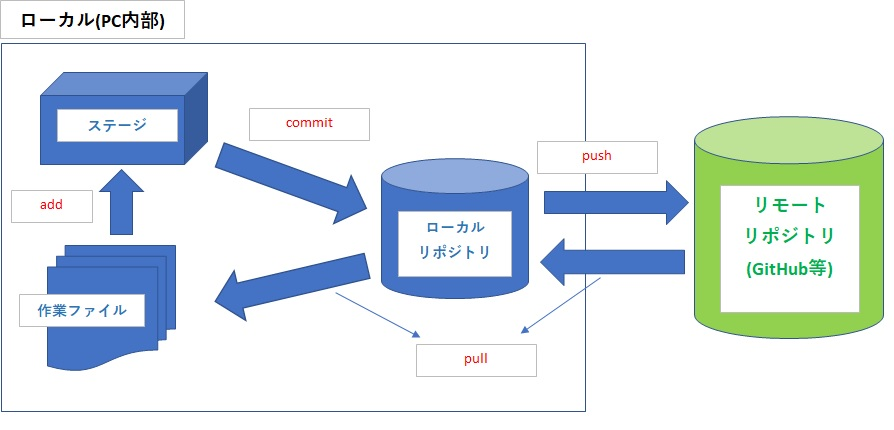

# Gitメモ
Gitの基礎や使い方の備忘録。以下の構成で記載する。  
 ~~SourceTreeの使い方は、別途 [SourceTreeメモ](./source_tree.md)で纏める。~~  

## 目次
- [Git概要](#Git概要)  
- [用語](#用語)  
- [使用方法](#使用方法) 
- [演習](#演習)  

# Git概要
Gitについて順を追って解説する。  
「細かいことはいいから使い方だけ教えろ！」っていう方は「[使用方法](#使用方法)」まで飛ばしてください。  

### そもそもGitとは？？
ファイルのバージョン(履歴)を管理する為のソフト。  
仮にGit無しでファイルの変更履歴を管理(アナログなやり方で)しようとする大体以下の様になる。
- ファイルの名称に"ver"や"rev"、"日付"等をつけてナンバリング
- バージョン管理用の台帳作る　など  
  
しかしこれだとバージョンの前後で、具体的にどこを変更したか探すのが大変であり、数が増えてくるとどのバージョンが何の変更を何のためにしたものか正直わからない。(台帳に全部書けばいい話だけど、それも煩雑)  
更にバージョンを戻す時は、「コピペしてファイル名変えて、今はどのバージョンを使っているかメモして...」なんて事をしなければならない。  
gitはこれらを楽に実現する為に使うツールである。

### Gitによる履歴管理
gitで管理対象とするディレクトリには「.git」フォルダが作られ、これが履歴管理用のローカルリポジトリ(履歴情報の保管庫)となる。(図１参照)  
||
|:---:|
||
| 図１　.gitディレクトリ|  

gitはローカル内に大きく分けて３つのファイル保存領域を持ち、管理対象のファイルは以下の手順で状態遷移・登録される。
(※リモートリポジトリは外部のものなのでカウントしていない)
```
ワーキングツリー -> ステージ -> ローカルリポジトリ -> リモートリポジトリ
```
- 作業ディレクトリ　(ワーキングツリー)
  - ユーザーが作業しているディレクトリ領域。  
  　現在自身が操作しているファイル群を指す。普段我々が目にしているエクスプローラ上のディレクトリと思って良い。
- ステージエリア　(インデックス)
  - 作業ディレクトリとローカルリポジトリの中間領域。
  - コミット前にワーキングツリーの変更内容を、このエリアへ登録する必要がある。
  - `$git add`コマンドはこのエリアにファイル変更を登録する為のコマンド。
- ローカルリポジトリ　
  - ファイルやディレクトリの履歴を管理する領域。
  - `$git commit`はこの領域にファイルの変更履歴を登録すること。

||
|:---:|
||
| 図2　ファイル保存領域|

### Gitにおけるファイルの状態 & ローカルにおける基本フロー
Gitの管理対象にしたファイルは、いくつかの状態を取ることになる。各状態は以下の通り。 
- 非追跡対象(untracked)
  - Gitの管理対象外。「.gitignore」ファイルに登録したファイルが該当。
  - Gitは「.gitignore」に書かれているﾊﾟｽのファイルを無視する。
- 追跡対象(tracked)
  - Git管理下にあり、履歴として登録されている状態。(commit完了後の状態)
  - 後述するがリモートにpushしたり、checkoutできる様になる。
- 変更されている(modified)
  - Git管理下にあり、commit後からファイルが変更されている状態。
  - `$git add`コマンドでステージ状態(インデックス)へ移行する。
- ステージされている(staged)  
  - Git管理下にあり、変更ファイル(modefied)をステージ(インデックス)した状態。
  - この状態になって初めてコミット(`$git commit`)できる。  

図2が上記ファイル状態遷移を示したものである。 
 
冗長になるが下図3を交えて改めてGitのフローを説明すると、以下の通り。
- 赤色のuntrackedは「.gitignore」には登録されていないが、まだGitで管理していないファイルであることを示す。(新規作成ファイルなどがこの状態)
- 緑色のunmodified状態のファイル(追跡ファイル)を編集し変更を加える事で黄色のmodifie状態となる
- これを`$git add`することで青色のstaged状態となる  
- この状態で`$git commit`によりコミットを行い、緑色の状態に戻る事となる。


||
|:---: |
||
| [図3．Git公式リファレンスより](https://git-scm.com/book/ja/v1/Git-%E3%81%AE%E5%9F%BA%E6%9C%AC-%E5%A4%89%E6%9B%B4%E5%86%85%E5%AE%B9%E3%81%AE%E3%83%AA%E3%83%9D%E3%82%B8%E3%83%88%E3%83%AA%E3%81%B8%E3%81%AE%E8%A8%98%E9%8C%B2) |

#### ローカルリポジトリとリモートリポジトリのブランチについて
まず、ローカルリポジトリ(自分のPC内)には、「ローカルブランチ」と「リモートトラッキングブランチ」の２種類がある。
そして、リモートリポジトリ(GitHub等の外部リポジトリ)には、「リモートブランチ」がある。  

下図ブランチの通り、リモートトラッキングブランチはあくまでリモートリポジトリ(GitHubなどの外部リポジトリ)のブランチを参照しているものである。  
このリモートブランチをリモートトラッキングブランチに反映させるのがfetch操作であり、リモートトラッキングブランチの変更を作業ツリーが参照しているローカルブランチに反映させるのが、`git merge`操作である。  
`git pull`(`fetch + merge`)はこれらをまとめた操作。 

```
#ローカルリポジトリ

[ ローカルブランチ ]                       [ リモートトラッキングブランチ ] 
A--B--C--D (master)                        A--B--C--D (origin/master)
　　　　\                                          \
         E--F--G (feature)                          E--F (origin/feature) 
             \                                              
              H--I (develop)                   
　　　　　　　　　
　　　　　　  　                   
-------------------↓↓↓ 上記２つを纏めて書くと....-----------------------------       

A--B--C--D (master,origin/master)
       \
        E--F--G (feature,origin/feature)
            \
             H--I (develop)
```
```
#リモートリポジトリ

A--B--C--D (origin/master)
　　　　\
         E--F (origin/feature)
```
 
リモートから作業ツリーに反映されるまでをフローで書くと以下様なイメージ。  
```
リモートブランチ ==> リモートトラッキングブランチ ==> ローカルブランチ ==> 作業ディレクトリ
```


# 用語

- ブランチ  
   - ファイルの変更履歴を辿る道のようなもの。  
   - ブランチは分けたり、１つにまとめたりできる。

- ローカルリポジトリ
  - 自身のPC上にあるリポジトリの事。ファイル履歴の保管庫だと思えばいい。

- リモートリポジトリ
  - ネットワーク上にあるリポジトリ。GitHubとかのこと。

- ステージ(インデックス)
   - ファイルの変更後、コミット対象にする為の状態。つまりステージしなければコミットはされない。

- コミット
   - ステージされたファイルをリポジトリに登録する操作。これによりブランチに反映される。

- HEAD
  - 最新のコミットリビジョンであることを示す。
  - コミットの度に自動的に割り当てられる変数とでも思っておけば良い。

- origin
  - 一般的にリモートであることを示す為の識別名。別の名にもできるがoriginとする(デフォルト)のが一般的。  
  - "origin/ブランチ名"のようになっていればリモートのブランチであることを表している。
  ※リモートを参照しているだけ(リモートトラッキングブランチ)であり、あくまでローカル内のブランチ。

- ブランチ命名規則(一般的な標準)
  - master : 現在の製品ver
  - develop : 次回リリースの開発用
  - feature : 新規機能の開発。developからの分岐であり、最終的にdevelopにマージする。
  - release : 次回リリースの準備用。developから分岐し、developとmasterへマージする。　
  - hotfix : 現在の製品バージョンのバグフィックス用。masterから分岐し、developとmasterへマージする。
　※これらの末尾にチケット番号や、バージョン番号つける。

- 競合(conflict)
  - gitにおける競合は、同一ファイルを別のユーザーがそれぞれ編集した際に発生する。  
  - 2つのブランチをマージしたとき双方ブランチのコミットに整合が取れなくなり、どちらのブランチコミットが正なのか分からなくなっている状態。ファイルを手作業で編集してコミットしてやる必要がある。

--- 

 # 使用方法  
 日常的に使用するもののみ記載する。  
 コマンドについては勿論だが、オプションについてもここでは書ききれないので、詳細はリファレンス等を参照願う。  

| 操作種類(コマンド) | 用途 |
|:---|:---|
|[add](#addコマンド) | 変更したファイルをステージ状態にする|
|[branch](branchコマンド)| ブランチの確認・作成・削除|
|[checkout](#checkoutコマンド) | ブランチの切替え・ブランチ中の任意のスナップショットを作業ディレクトリに反映|
|[clone](#cloneコマンド) | リモートリポジトリのブランチをローカルリポジトリにコピーする|
|[commit](#commitコマンド)| コミットする|
|[config](#configコマンド)|git設定のためのコマンド|
|[fetch](#fetchコマンド)|リモートブランチをローカルにあるリモートトラッキングブランチにコピーする|
|[init](#initコマンド)　|ローカルリポジトリを作成する|
|[merge](#mergeコマンド)|複数のブランチを1本に合流させる|
|[pull](#pullコマンド) |  リモートリポジトリの変更をローカルに反映させる|
|[push](#pushコマンド) |　ローカルの内容をリモートリポジトリへ登録する|
|[reset](#resetコマンド) | コミットを取り消す(hard/mixed/soft)|
|[revert](#revertコマンド)|コミット内容を全て取り消すコマンド|
|[remote](#remoteコマンド)|リモートリポジトリの管理コマンド|
|[stash](#stashコマンド)|　コミット前の変更ファイル退避・適用|  

### addコマンド
```shell
#ファイル指定
$git add "ファイル名"

#追跡中の全ファイル
$git add --all
```
### branchコマンド
##### ブランチの確認  
```shell
#ローカルブランチ
$git branch
```  
```shell
#リモートブランチ
$git branch -r
```
```shell
#ローカル&リモート全て
$git branch -a
```
##### ブランチ作成
```shell
#現在のブランチをもとに派生ブランチ生成
git branch "作成するブランチ名"
```
### checkoutコマンド
##### ブランチの切替え
```shell
$git checkout "切り替えたいブランチ名"
```
##### ブランチ中の履歴を作業ツリーへ反映
```shell
$git checkout "ブランチ名" "反映させたいコミットリビジョン"
```
### cloneコマンド
```shell
#カレントディレクトリをクローンさせたいディレクトリにして以下を実行
$git clone "リモートのURL"
```
URLのリモートリポジトリがローカルリポジトリとして丸々コピーされる。
### commitコマンド
```shell
#add実行後
$git commit
```
### configコマンド  
```shell
$git config [-オプション1] 設定項目キー名 設定値 
```
Git設定に関するコマンド。`git config -l`で現在の設定を表示。
設定のスコープが以下の3種類ある。上->下に優先度が下がっていく。
- --system ：システム全体
- --global ：ユーザーのリポジトリ全体
- --local ：対象リポジトリのみ  

設定項目は以下の通り
- `user.name`　：ユーザ名
- `user.email`　：メール

### fetchコマンド
```shell
$git fetch　"ブランチ名"
```
リモートリポジトリのブランチ変更をローカルにあるリモート追跡ブランチにコピーする。
ローカルブランチに反映するのは後述のmergeコマンド。

### initコマンド
```shell
#カレントディレクトリをgitで管理したいディレクトリにした状態で以下を実行
$git init
```
「.git」フォルダが生成される。  
この時点ではローカルリポジトリが作成されただけで、ファイル履歴は登録されていない。
`add`及び`commit`を行う必要がある。

### mergeコマンド
```shell
#通常のマージ操作
$ git merge "合流させるブランチ名"

A--B--C------F--G  (master)
       \    
        D--E  (feature)
```
```shell
#fast-forwardマージ（コミットが発生しないマージ)
#図例のように分岐元のコミットが、分岐以降変更されていない時に行われるマージの事。
#コミットは発生せずにマージする。(マージしたという履歴が残らない)
#以下のオプションをつけることで、マージしたというコミットが残せる。
$ git merge --no--ff feature 

A--B--C  (master)                      
       \　　　　　　　　　　==>    A--B--C--D--E (master/feature)  
        D--E  (feature)
```

現在のブランチに指定したブランチを結合(合流)させる。　　
後述のpull時は、リモート追跡ブランチ(origin/ブランチ名)とローカルブランチをmergeしている事になる。
また、

### pullコマンド
```shell
$git pull [プルするリモートのURL]
```
fetchコマンド+mergeコマンドを合わせたものだと思っておｋ。  
URLは基本的に要らないはず。
競合(conflict)エラー出るようなら、競合を解決してから再度pullする。

### pushコマンド
```shell
$git push "リモートURL" "ブランチ名"
```
URLは「origin」として登録するのが一般的。

### resetコマンド
```shell
#コミットのみを取り消す。インデックスと作業ツリーの変更はそのまま残る。(変更されたまま) 
#HEAD...つまり最新コミットから2コミット戻す場合
$git reset --soft HEAD~2
#ブランチ上の指定ハッシュ値を持つコミットに戻す場合
$git reset --soft "ハッシュ値"
```  
いずれもコミットを消す(ブランチから履歴が消える)操作なので、実行前に要確認。
そもそもやらないに越したことはないので、push前はコミット内容に間違い無いか確認を怠らない事！
- softリセット
  - softリセットはとりあえずコミットだけを取り消したい時に使う。
  - リセット後、そのままpushすれば元通りにできるので、まぁ何とかなる。

```shell
#コミットとインデックスを削除。作業ツリーの変更だけ残す。
$git reset --mixed [HEAD~戻す分の数値 | "ハッシュ値"]
```
- mixedリセット
  - インデックスに上げる必要のないものまでコミットしてしまった時に使う。
  - これについてもリセット後、ファイルに変更とか加えなければadd->commit->pushすれば何とかなる。

```shell
#コミット、インデックス、作業ツリー全ての変更を取消し、削除する。
$git reset --hard [HEAD~戻す分の数値|"ハッシュ値"]
```
- hardリセット
  - そもそもファイルの変更自体必要なかった場合等に使う。
  - 作業ツリーからも消える為、自分以外誰もpullしてなければ取返しがつかない。
  - 逆に言えば、hardリセットしたいなら、やる前に誰かにpullしといてもらうと安心。
  (よく分からずにやるなら怒られるだろうけど...)

### revertコマンド
指定のコミットリビジョンを取り消す為のコマンド。
`reset`との違いは、削除した履歴が残る点。  
リモートにpushまでしてしまった時などに、取り消す(元に戻す)方法。  
```shell
#指定のコミットをrevertする。-nオプションをつけると、リバートをコミットしない。
$git revert <commit ID> [-n]
```  
### remoteコマンド
```shell
$git remote [オプション] コマンド [リモートリポジトリエイリアス] [リモートURL]
```
リモートリポジトリの管理コマンド。  
- オプション
  - -v : 登録済みのリモートリポジトリ一覧表示
- コマンド
  - add :　新規追加する。エイリアスとリモートリポジトリURLを書く
  - remove :　指定されたエイリアスを削除(管理から削除)  

### stashコマンド
```shell
$ git stash save [stash名(保存名)]
```
変更したファイルを一時的に退避させる。一般に以下のような時に使う。
- 一時的に変更前のファイルに戻して、後で変更後ファイルに戻す時
- 競合発生時、自身が変更したファイルを一旦バックアップとして取っておきたい時

```shell
$ git stash list
```
- stashの一覧表示。
```shell
$ git stash apply "stash名"
```  
- 保存したstashを現在の作業ツリーに反映させる。
