# Powershell リモート操作
## 目次
- [文字化け..](#文字化けする時)
- [SSH:リモートログイン](#SSH)
- [SCP:リモートファイル転送](#SCP)
- [WOL:リモート起動](#WOL)
- [リモートGUI](#X)

## 文字化けする時
Powershellからリモートにログインした際、文字化けする場合は以下をそれぞれ試してみる。  

> Powershellのフォント変更
1. Powershellを起動し、下画像の赤丸内で右クリックし、プロパティを選択。  
2. 「フォント」タブのフォントでMSゴシックを選択。

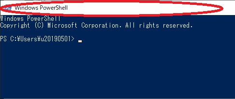


> 文字コードの変更
1. Powershellで$OutputEncodingコマンドを打ち、文字コードを確認する。
2. リモート側のコンソール(or SSHログイン状態)で、```echo $LANG```打つ。
3. 1&2項で確認した文字コードに相違あれば、どちらかに統一する。    


## SSH
```shell
$ ssh -l リモートユーザー名 リモートホスト名(or IPアドレス)
```
- リモートサーバへログインするコマンド。telnetのセキュア版。(ウェルノウンポート：22)  
- サーバ側で、パスワードor秘密鍵の認証方式を設定できる。(デフォはパスワード？)　
- selinux有効だと、接続できなくなることがある。(/etc/selinux/config参照)
- sshの設定は/etc/ssh/sshd_config参照。
  
## SCP
```shell
//リモート⇒ローカルへコピー
$ scp リモートユーザー名@リモートホスト名:コピーしたいリモートのファイル名　ローカルのコピー先

//ローカル⇒リモートへコピー
$ scp ローカルのコピーしたいファイルパス　リモートユーザー名@リモートホスト名:コピー先パス
```
- リモート⇔ローカル間でファイル転送を行うときに使うコマンド。  
ローカル/リモートいずれに向けて行う場合でも、ローカル(自分)側でコマンドを実行する。※1
- ディレクトリをコピーする場合は、「-r」オプションを付ける。

※1.scpは「sshを使ってファイル転送」する為、sshでログインする必要なし。SSH+FTPと思っておk？？

## WOL
Wake On LAN : ローカルからLAN経由でリモートマシンを起動することが出来るらしい。

## X-WindowsSystem
WindowsマシンからリモートのLinuxサーバのGUIを利用する。
#### 1. 準備
- Linux側(リモート)の準備
   - ssh-Server(リモートログインできる状態)
   - GUIがインストールされている。(ex.gnome)
- Windows側で用意するもの
   - Xming(下記URLのPublicDomainからDL)
   - Xming-fonts(同上)
    http://www.straightrunning.com/XmingNotes/
   - OpenSSH(OpenSSH-Win64.zip)
   https://github.com/PowerShell/Win32-OpenSSH/releases
#### 2. リモート側(Linux)
- sshd_conf編集
  /etc/ssh/sshd.confのX11Forwardingをyesにする。  
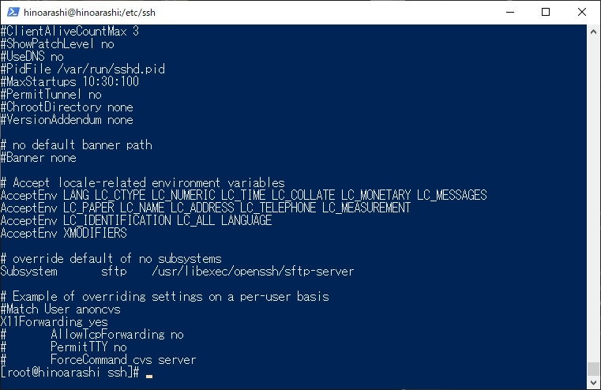

- $DISPLAYの設定
  ```shell
  $ echo $DISPLAY
  //表示が何もない(何も設定されていない)なら以下を実行する。

  $ export DISPLAY=localhost:0.0
  ```

#### 3. ローカル側(Windows)
- Xming,fontsインストール
　基本デフォルトで問題なし。(fontsも同様)
   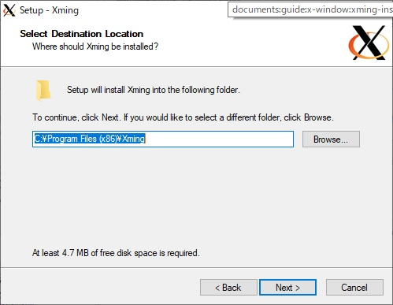
   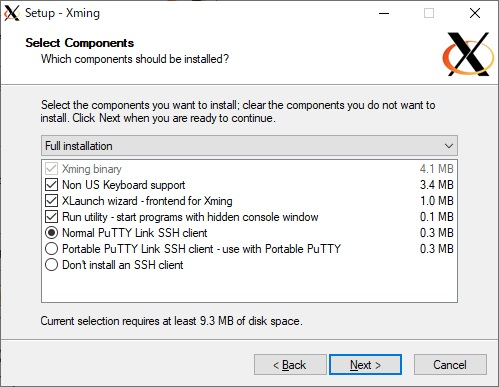
   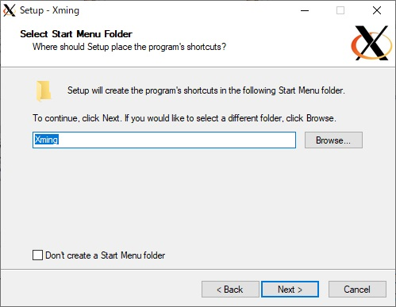
   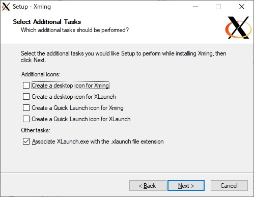  

- xmingの設定(xLanch)
  XLanchを起動し、以下の手順で設定を行う。
  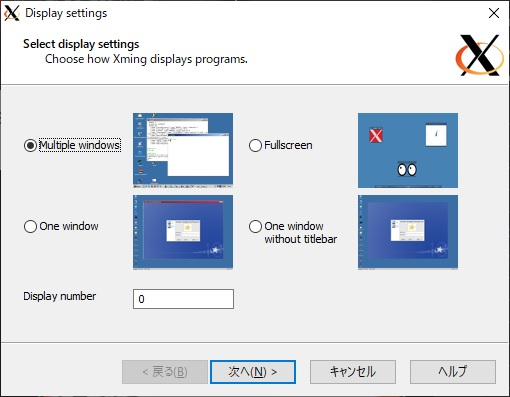
  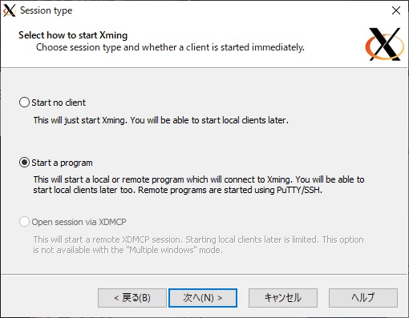
  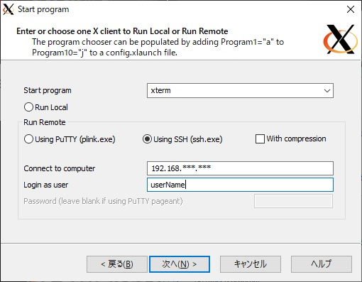
  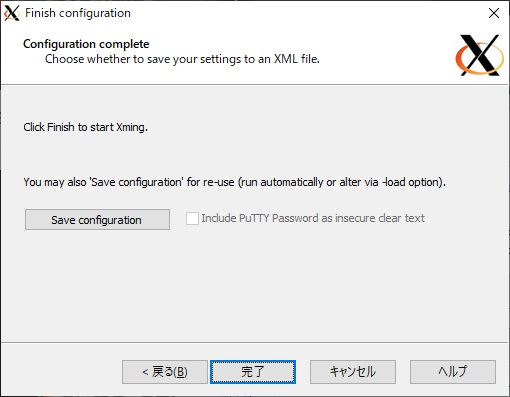

- xming(x0.hosts)の編集
  xmingフォルダ内のx0.hostsを開く。
  localhostの下にリモート接続するマシンのIPを追加する。

- ssh.exeのコピー
  DLしたOpenSSH-Win64.zipを解凍し、中にある"ssh.exe"をxmingフォルダ直下にコピーする。
  ※PuTTY使う場合は、plink.exeをコピーする。
　
　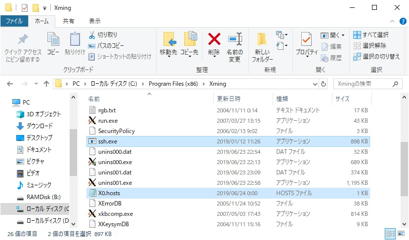

- teratermの設定
  teratermのメニューから「"設定"->"ssh転送"->"リモートの(X)アプリケーションをローカルのXサーバに表示するにチェックを入れる"->"OK"」
  その後、teratermを再起動する。
  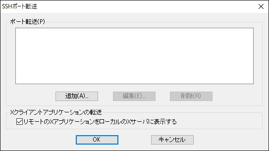

#### 4. 実行
以下の順で実行する。
1. xmingを起動する
2. teratermを起動しリモートログインする
3. GUIアプリケーションをコマンド起動する
   ```shell
   //最後に"&"をつける事
   $ firefox &
   ```
4. xmingでGUIが表示される