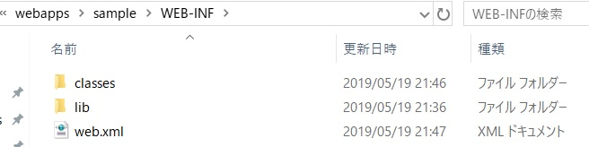

# Tomcatメモ
## Tomcatのディレクトリ構造

- bin 
  言わずもがなtomcatの実行バイナリファイル用。
- conf
  各設定ファイル
- logs
  ログファイルの出力先
- webapps
  デフォルトでは、作成したwebアプリを置く場所。(conf/server.xmlで変更可)

## webapps

図の様に、作成したwebアプリ(今回はsample)を配置する。
中には、WEB-INFを作成し、さらにその中にclasses,lib,web.xmlを配置する。

